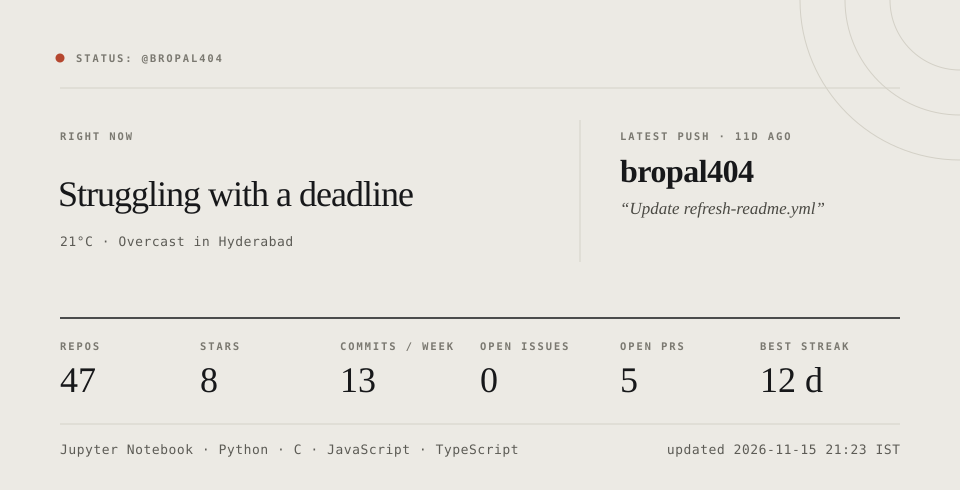

<!--
```json
{
  "status": "Struggling with a deadline",
  "weather": {
    "location": "Hyderabad",
    "temperature": "21°C",
    "condition": "Overcast "
  },
  "github": {
    "top_languages": [
      "Jupyter Notebook",
      "Python",
      "C",
      "JavaScript",
      "TypeScript"
    ],
    "latest_active_repo": "bropal404",
    "last_commit": "2026-11-04T10:18:24Z",
    "last_commit_message": "Update refresh-readme.yml",
    "current_streak": 1,
    "longest_streak": 12,
    "commits_last_7_days": 13,
    "open_issues": 0,
    "open_prs": 5,
    "total_repos": 47,
    "total_stars": 8,
    "most_starred_repo": {
      "name": "bropal404",
      "stars": 1
    }
  },
  "updated": "2026-11-15 21:23 IST"
}
```
-->
