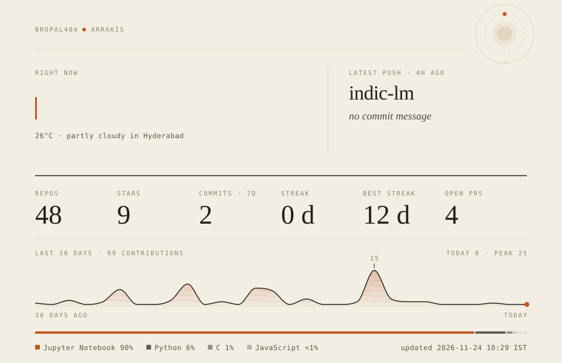

<!--
```json
{
  "status": "good morning, time to ship",
  "weather": {
    "location": "Hyderabad",
    "temperature": "26°C",
    "condition": "Partly Cloudy"
  },
  "github": {
    "top_languages": [
      "Jupyter Notebook",
      "Python",
      "C",
      "JavaScript",
      "TypeScript"
    ],
    "language_share": {
      "Jupyter Notebook": 89.5,
      "Python": 6.4,
      "C": 1.4,
      "JavaScript": 0.6,
      "TypeScript": 0.5
    },
    "latest_active_repo": "indic-lm",
    "last_commit": "2026-11-24T00:15:29Z",
    "last_commit_message": null,
    "current_streak": 0,
    "longest_streak": 12,
    "daily_contributions_30d": [
      1,
      0,
      3,
      0,
      2,
      11,
      0,
      0,
      3,
      15,
      0,
      2,
      0,
      12,
      10,
      0,
      4,
      0,
      0,
      2,
      25,
      4,
      2,
      2,
      0,
      0,
      0,
      1,
      0,
      0
    ],
    "commits_last_7_days": 2,
    "open_issues": 0,
    "open_prs": 4,
    "total_repos": 48,
    "total_stars": 9,
    "most_starred_repo": {
      "name": "bropal404",
      "stars": 1
    }
  },
  "updated": "2026-11-24 10:29 IST"
}
```
-->
